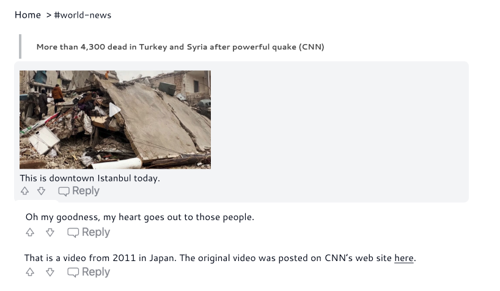
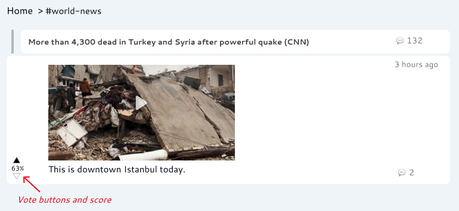

# Jabble: Better Online Conversations

Jabble is a new kind of conversation platform, designed to make conversations on the Internet more intelligent and less polarized.

Read how Jabble makes conversations better below. And signup here to [get notified when we Launch](https://social-protocols.org/social-network/)

# How Jabble Makes Conversations Better

Like many online social platforms, in Jabble users post things and other users can reply. Here's an example:

 *a post with a reply*

Each post or reply then gets a score, shown as a percentage, based on how many upvotes and downvotes it receives.

 *a reply with votes*

**However, not all votes count equally!** Two factors affect the strength of your votes:

1) You must earn **reputation** before your votes have any weight.

2) Your votes on a post get more weight if they **read and acknowledge certain replies** to that post made by other users.

# 1. Information and Fairness

When certain conditions are met, a reply to a post will be designated a **critical reply**. The critical reply will be indicated by a green dot.

 *a critical reply*

Users who have voted on the post, but have not yet seen the critical reply, will be notified. 

Once a user has voted on the critical reply, their vote on the post will get more weight. If the critical reply changes their mind about the post, they can also change their vote on the post.

 *a critical reply after vote*

## The Big Idea

The idea is simple. If one user shares information that might influence other people's votes, then people should have a chance to consider that information **before** they decide how to vote.

Clickbait, disinformation, misinformation, etc. are all fundamentally the same thing: misinformed content. Stuff people wouldn't click on, upvote or share if they knew more.

The antidote to misinformation is...information. The Jabble tries to promote more informed conversations based on the simple idea of looking at how people vote if they have more information.

## Identifying the Critical Reply

Jabble identifies a reply as critical if it appears to be **convincing**: if it makes people more or less like to vote on the post. 

Suppose that, in our example with the inauthentic earthquake video, the upvote probability starts out close to 95%. But among users who voted on the reply claiming the video was not what it claimed to be, the upvote probability falls to 5%. Since it appears to be very convincing, it is designated a critical reply. 

### The Critical Thread

But the conversation is not finished! Jabble informs users who upvoted the video and gives them a chance to change their vote or to respond. Maybe the video isn't fake after all! If anyone makes a convincing reply to the reply, then that reply will be designated as the critical comment, and the process will continue.

The thread of the most convincing replies, the most convincing reply to that reply, etc. is called the critical thread.

 *a critical thread*

It might seem like this process could go on forever, but it probably won't. As we hope to demonstrate with early Jabble users, we expect most discussions will converge after the strongest arguments have been made on each side of an issue and nobody can find anything to say that further changes minds. 

## Informed Votes

The votes of users who have voted on the critical thread are called the **informed votes**. The score on the post is an estimate of the **informed upvote probability**. 

In our example with the earthquake video, informed users are much less likely to upvote, and since informed votes have more weight, as users start to vote on the critical reply the estimated informed upvoted probability falls quickly.

Once a sufficiently large sample of informed votes has been collected, the estimate of the informed upvote probability is dominated by the informed votes. The exact formula for calculating the informed upvote probability is described [here](https://social-protocols.org/global-brain/modeling-upvote-probability.html). 

In this example, even though most users have upvoted the video, the informed upvote probability approaches 5%. 

 *the informed vs. uniformed upvote probability in a simulated scenario*

# 2. Reputation and Reasonableness

This process works great if everyone is acting in good faith. But that usually doesn't happen on the Internet. So how do we force people to be **reasonable**?

Well, it turns out you kind of can force people to be reasonable using game theory. 

Every user gets a reputation, starting with 0. Until a user gains reputation, their vote has no weight.

Users gain reputation according to an ingenious scoring mechanism from MIT called the Bayesian Truth Serum. The formula is designed so that a user's expected score is maximized if they vote **honestly** -- *as long as everyone else votes honestly*. This is brilliant be
cause, if people *expect* each other to vote honestly, then an equilibrium is established where users will *continue* to vote and expect others to vote honestly. This continues until users can get together and coordinate on voting dishonestly, which is unlikely to be a p
roblem as we [write about here]. This kind of equilibrium at honesty is similar to the magic that powers blockchains, as we [write about here].

Now, Jabble only considers **informed votes** when calculating the BTS scores. This means that people earn reputation by voting honesty **given the comments in the critical thread**. Users most honestly consider the information in the critical thread, and decide whether they think that other people in this forum would honestly upvote it or downvote it given this information.

If the evidence proving the video is fake is strong enough, then not only will most everybody believe that the video is fake -- they will also expect that all the other voters who saw the evidence to believe the video is fake. So as long as there is an equilibrium at honesty, everyone will downvote the video.

So if there is an equilibrium at people voting honestly **given** the information and arguments provided, we can say there is an equilibrium at **being reasonable**.

# 3. Karma and Community

In Jabble, you contribute to a conversation not so much by what you say, but *what you vote for*. Posts themselves are anonymous, and the karma earned by a post is divided among all the people who upvoted the post, with earlier upvoters receiving a larger share of karma than later upvoters. The author of the post themselves, being the first upvoter, receives the largest share.

But don't try to harvest karma just by upvoting everything. You also have a *reputation* score within each community. Before your votes have any weight, you need to build reputation by upvoting content that ultimately earns a high score from existing members of the community (or downvoting low-scoring content). And if you upvote too many things that receive a low score (or vice versa), you will lose reputation in that community. 

On the other hand, you may gain reputation with the same content in a different community! So when upvoting or downvoting, consider the community. By upvoting, you are *recommending* content to that community, and staking your reputation on the belief not only that it will be popular in that community, but that it will *stand up to scrutiny*: that it is not fake, or misleading, and thus will still have a high score among users who saw the the critical comment thread.

<!--
TODO: but doesn't the algorithm encourage people to upvoet een if they are in the minority.-->

If you are not sure, you can also just upvote content you like, without specifying a community, and Jabble will find the community for you! This is great for people with a variety of interests. You can upvote content related to your profession, as well as cute pet pics, without worrying about wasting the time and attention of people who aren't interested in one or the other.

## Reputation vs Karma

Reputation has a cap, but you can earn unlimited Karma. Reputation is an estimation of the score a post will receive within a community **given** you upvote it. Karma is your total contribution to the community. 

You can maintain a high reputation without accumulating much Karma by upvoting high-quality content, but infrequently. Or you can have a fairly low reputation and still accumulate a lot of Karma by upvoting a lot of mediocre content. But you earn Karma faster if you have a higher reputation.

# 3. Bias and Bridging

A final piece of Jabble's scoring formula is **briding**.

TODO: describe bridging and summarize.

# 4. Prediction and Precision

A final piece of the Jabble process is the prediction market. At any time, you can make a prediction about what the final score of a post will be. Accurate predictions further boost your reputation. Predictions are a part of the Bayesian Truth Serum scoring mechanism.

TODO: describe predcition arket

## Fairness

This is essential to producing a **fair** outcome. In a jury trail, is it not fair if information that would have changed the jurors' verdict is withheld from them. Similarly it is not fair if a video gets more upvotes than it would have if users knew it was not authentic.

Sure, a viral video on social media is not a jury trail. It doesn't really matter if it gets more votes than it deserves, does it?

But actually, **what kind of content gets attention in social media matters a great deal**. When misinformed or divisive content is rewarded with attention, people post and share more misinformed and divisive content. The only way to fix conversations on the internet is to make it so that the right kind of content gets more attention.

In a platform where the number of votes determines how much attention something receives, it matters a great deal if an in authentic video gets more votes than it would have if users knew it was inauthentic. People don't *want* their time and attention wasted with fake videos. And yet the fake video is rewarded with attention because people voted on it, not knowing it was fake. This isn't the way it should work.

Social media can be thought of as a protocol for collaboratively determining what content receives attention. Upvotes and downvotes are how the community expresses their intention. And so it's critical that the outcome of the vote be informed and fair.

